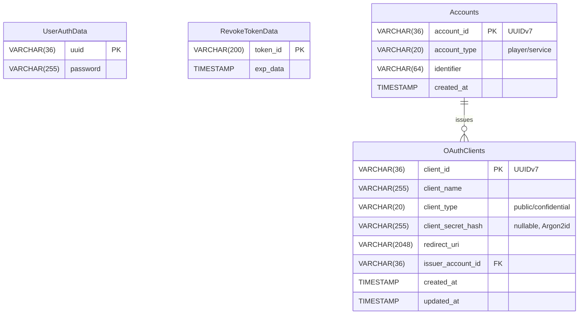

## 👤 UserAuthData

ユーザー認証情報を管理するテーブル。

| Column Name | Type | Example | Description |
|-------------|------|---------|-------------|
| uuid | VARCHAR(36) PK | `550e8400-e29b-41d4-a716-446655440000` | プレイヤーのMinecraft UUID |
| password | VARCHAR(255) | `$argon2id$v=19$...` | Argon2idでハッシュ化されたパスワード |

---

## 🔑 RevokeTokenData

無効化されたトークンを管理するテーブル。

| Column Name | Type | Example | Description |
|-------------|------|---------|-------------|
| token_id | VARCHAR(200) PK | `abc123...` | 無効化されたトークンのID |
| exp_data | TIMESTAMP | `2025-01-06 12:00:00` | トークンの有効期限 |

---

## 🆔 Accounts

アカウント情報を管理するテーブル。プレイヤーアカウントとサービスアカウント（ロボットアカウント）の両方をサポート。

| Column Name | Type | Example | Description |
|-------------|------|---------|-------------|
| account_id | VARCHAR(36) PK | `019234ab-...` | アカウントID（UUIDv7、時間ソート可能） |
| account_type | VARCHAR(20) | `player` | アカウント種別: "player" または "service" |
| identifier | VARCHAR(64) | `550e8400-e29b-41d4-a716-446655440000` | プレイヤーの場合はMinecraft UUID、サービスの場合はサービス名 |
| created_at | TIMESTAMP | `2025-01-06 12:00:00` | アカウント作成日時 |

---

## 🔐 OAuthClients

OAuth2/OIDCクライアントアプリケーションを管理するテーブル。

| Column Name | Type | Example | Description |
|-------------|------|---------|-------------|
| client_id | VARCHAR(36) PK | `019234ab-...` | クライアントID（UUIDv7、時間ソート可能） |
| client_name | VARCHAR(255) | `My OAuth App` | クライアントの表示名 |
| client_type | VARCHAR(20) | `confidential` | クライアント種別: "public" または "confidential" |
| client_secret_hash | VARCHAR(255) NULL | `$argon2id$v=19$...` | Argon2idでハッシュ化されたシークレット（Publicの場合はNULL） |
| redirect_uri | VARCHAR(2048) | `https://example\.com/callback.*` | リダイレクトURI（正規表現パターン対応） |
| issuer_account_id | VARCHAR(36) FK | `019234ab-...` | 発行者のアカウントID（Accountsテーブル参照） |
| created_at | TIMESTAMP | `2025-01-06 12:00:00` | クライアント作成日時 |
| updated_at | TIMESTAMP | `2025-01-06 12:00:00` | クライアント更新日時 |

---

## 📊 ER Diagram

