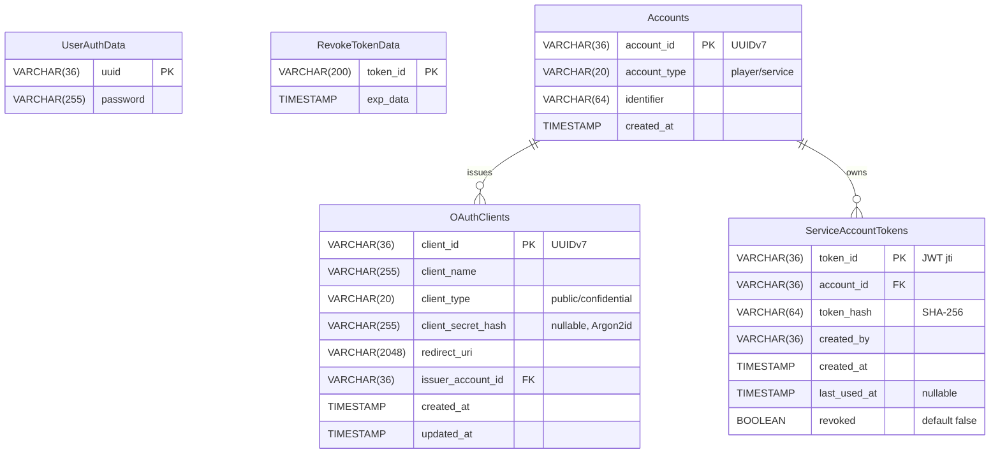

## UserAuthData

Table for managing user authentication information.

| Column Name | Type | Example | Description |
|-------------|------|---------|-------------|
| uuid | VARCHAR(36) PK | `550e8400-e29b-41d4-a716-446655440000` | Player's Minecraft UUID |
| password | VARCHAR(255) | `$argon2id$v=19$...` | Password hashed with Argon2id |

---

## RevokeTokenData

Table for managing revoked tokens.

| Column Name | Type | Example | Description |
|-------------|------|---------|-------------|
| token_id | VARCHAR(200) PK | `abc123...` | Revoked token ID |
| exp_data | TIMESTAMP | `2025-01-06 12:00:00` | Token expiration time |

---

## Accounts

Table for managing account information. Supports both player accounts and service accounts (robot accounts).

| Column Name | Type | Example | Description |
|-------------|------|---------|-------------|
| account_id | VARCHAR(36) PK | `019234ab-...` | Account ID (UUIDv7, time-sortable) |
| account_type | VARCHAR(20) | `player` | Account type: "player" or "service" |
| identifier | VARCHAR(64) | `550e8400-e29b-41d4-a716-446655440000` | Minecraft UUID for players, service name for services |
| created_at | TIMESTAMP | `2025-01-06 12:00:00` | Account creation timestamp |

---

## OAuthClients

Table for managing OAuth2/OIDC client applications.

| Column Name | Type | Example | Description |
|-------------|------|---------|-------------|
| client_id | VARCHAR(36) PK | `019234ab-...` | Client ID (UUIDv7, time-sortable) |
| client_name | VARCHAR(255) | `My OAuth App` | Client display name |
| client_type | VARCHAR(20) | `confidential` | Client type: "public" or "confidential" |
| client_secret_hash | VARCHAR(255) NULL | `$argon2id$v=19$...` | Secret hashed with Argon2id (NULL for public clients) |
| redirect_uri | VARCHAR(2048) | `https://example\.com/callback.*` | Redirect URI (supports regex patterns) |
| issuer_account_id | VARCHAR(36) FK | `019234ab-...` | Issuer's account ID (references Accounts table) |
| created_at | TIMESTAMP | `2025-01-06 12:00:00` | Client creation timestamp |
| updated_at | TIMESTAMP | `2025-01-06 12:00:00` | Client update timestamp |

---

## ServiceAccountTokens

Table for managing service account tokens. Stores metadata for JWT tokens issued to service accounts.

| Column Name | Type | Example | Description |
|-------------|------|---------|-------------|
| token_id | VARCHAR(36) PK | `019234ab-...` | Token's JWT ID (jti claim) |
| account_id | VARCHAR(36) FK | `019234ab-...` | Account ID (references Accounts table) |
| token_hash | VARCHAR(64) | `a1b2c3d4...` | SHA-256 hash of the token (for leak verification) |
| created_by | VARCHAR(36) | `550e8400-...` | Player UUID of the administrator who created the token |
| created_at | TIMESTAMP | `2025-01-06 12:00:00` | Token creation timestamp |
| last_used_at | TIMESTAMP NULL | `2025-01-07 09:30:00` | Last used timestamp (NULL if never used) |
| revoked | BOOLEAN | `false` | Whether the token has been revoked |

---

## ER Diagram

