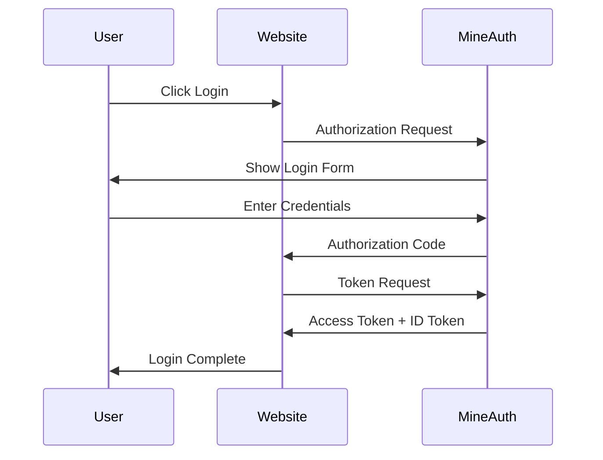

This guide explains how to integrate MineAuth OAuth authentication with web applications. We'll demonstrate using [better-auth](https://www.better-auth.com/) as an example.

## Overview

MineAuth provides standard OpenID Connect (OIDC) endpoints. You can integrate with any OAuth2/OIDC compatible library.



## Prerequisites

- OAuth client created in MineAuth ([Quick Start Guide](/docs/administrator/quick-start))
- MineAuth server accessible from your web application
- Node.js project with better-auth installed

## Setup with better-auth

### Install Dependencies

```bash
npm install better-auth @better-auth/generic-oauth
```

### Configuration

Create your auth configuration file:

```typescript title="lib/auth.ts"
import { betterAuth } from "better-auth";
import { genericOAuth } from "@better-auth/generic-oauth";

export const auth = betterAuth({
  // Your application's base URL
  baseURL: process.env.REDIRECT_AUTH_URL,
  // Secret for signing sessions
  secret: process.env.AUTH_SECRET,
  plugins: [
    genericOAuth({
      config: [
        {
          // Provider identifier
          providerId: "mineauth",
          // OAuth client ID from MineAuth
          clientId: process.env.MINEAUTH_CLIENT_ID!,
          // Leave empty for Public clients (PKCE)
          clientSecret: "",
          // Enable PKCE for Public clients
          pkce: true,
          // MineAuth OpenID Connect discovery URL
          discoveryUrl: `${process.env.MINEAUTH_URL}/.well-known/openid-configuration`,
        },
      ],
    }),
    // Add other plugins as needed
  ],
});
```

### Environment Variables

Set the following environment variables:

```bash title=".env"
# Your website URL
REDIRECT_AUTH_URL=http://localhost:3000

# Random secret for session signing
AUTH_SECRET=your-random-secret-here

# MineAuth client ID (from /ma client create)
MINEAUTH_CLIENT_ID=your-client-id

# MineAuth server URL
MINEAUTH_URL=https://your-minecraft-server.com:8443
```

## Client Type Configuration

### Public Client (Recommended for Web)

For browser-based applications, use PKCE without a client secret:

```typescript
genericOAuth({
  config: [
    {
      providerId: "mineauth",
      clientId: process.env.MINEAUTH_CLIENT_ID!,
      clientSecret: "", // Empty for Public clients
      pkce: true,       // Required for Public clients
      discoveryUrl: `${process.env.MINEAUTH_URL}/.well-known/openid-configuration`,
    },
  ],
}),
```

### Confidential Client

For server-side applications with secure secret storage:

```typescript
genericOAuth({
  config: [
    {
      providerId: "mineauth",
      clientId: process.env.MINEAUTH_CLIENT_ID!,
      clientSecret: process.env.MINEAUTH_CLIENT_SECRET!,
      pkce: false,
      discoveryUrl: `${process.env.MINEAUTH_URL}/.well-known/openid-configuration`,
    },
  ],
}),
```

## Framework Integration

### Next.js

```typescript title="app/api/auth/[...all]/route.ts"
import { auth } from "@/lib/auth";
import { toNextJsHandler } from "better-auth/next-js";

export const { GET, POST } = toNextJsHandler(auth);
```

### TanStack Start

```typescript title="app/lib/auth.ts"
import { betterAuth } from "better-auth";
import { genericOAuth } from "@better-auth/generic-oauth";
import { tanstackStartCookies } from "better-auth/tanstack-start";

export const auth = betterAuth({
  baseURL: process.env.REDIRECT_AUTH_URL,
  secret: process.env.AUTH_SECRET,
  plugins: [
    genericOAuth({
      config: [
        {
          providerId: "mineauth",
          clientId: process.env.MINEAUTH_CLIENT_ID!,
          clientSecret: "",
          pkce: true,
          discoveryUrl: `${process.env.MINEAUTH_URL}/.well-known/openid-configuration`,
        },
      ],
    }),
    // Important: Place tanstackStartCookies last
    tanstackStartCookies(),
  ],
});
```

## Login Button Example

```tsx title="components/LoginButton.tsx"
import { authClient } from "@/lib/auth-client";

export function LoginButton() {
  const handleLogin = () => {
    authClient.signIn.oauth2({
      providerId: "mineauth",
    });
  };

  return (
    <button onClick={handleLogin}>
      Login with Minecraft
    </button>
  );
}
```

## User Information

After authentication, you can access user information including:

| Claim | Description |
|-------|-------------|
| `sub` | Player UUID |
| `name` | Minecraft username |
| `email` | Email address (if configured) |

See [Userinfo Endpoint](/docs/developer/oauth/userinfo) for more details.

## Troubleshooting

### Common Issues

**"Invalid redirect URI"**
- Ensure the redirect URI in your application matches exactly what was registered in MineAuth
- Check for trailing slashes

**"PKCE verification failed"**
- Make sure `pkce: true` is set for Public clients
- Verify the client type matches your MineAuth client configuration

**"Discovery URL not reachable"**
- Verify MineAuth server is running and accessible
- Check firewall settings for the MineAuth port

## Related Documentation

- [OAuth Discovery](/docs/developer/oauth/discovery) - OpenID Connect endpoints
- [Userinfo Endpoint](/docs/developer/oauth/userinfo) - User information claims
- [Error Responses](/docs/developer/oauth/error-responses) - OAuth error handling
