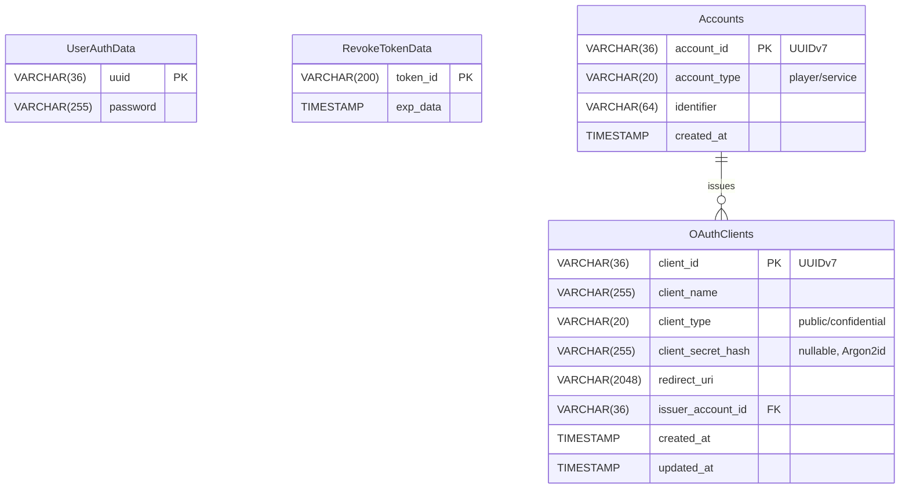

# 💾 Database Record Data Reference

import { UUIDV4, UUIDV7 } from '@site/src/components/uuid-examples';

## 👤 UserAuthData

ユーザー認証情報を管理するテーブル。

<table>
    <thead>
        <tr>
            <th>Column Name</th>
            <th>Type</th>
            <th>Example</th>
            <th>Description</th>
        </tr>
    </thead>
    <tbody>
        <tr>
            <td>uuid</td>
            <td>VARCHAR(36) PK</td>
            <td><UUIDV4 /></td>
            <td>プレイヤーのMinecraft UUID</td>
        </tr>
        <tr>
            <td>password</td>
            <td>VARCHAR(255)</td>
            <td>$argon2id$v=19$...</td>
            <td>Argon2idでハッシュ化されたパスワード</td>
        </tr>
    </tbody>
</table>

---

## 🔑 RevokeTokenData

無効化されたトークンを管理するテーブル。

<table>
    <thead>
        <tr>
            <th>Column Name</th>
            <th>Type</th>
            <th>Example</th>
            <th>Description</th>
        </tr>
    </thead>
    <tbody>
        <tr>
            <td>token_id</td>
            <td>VARCHAR(200) PK</td>
            <td>abc123...</td>
            <td>無効化されたトークンのID</td>
        </tr>
        <tr>
            <td>exp_data</td>
            <td>TIMESTAMP</td>
            <td>2025-01-06 12:00:00</td>
            <td>トークンの有効期限</td>
        </tr>
    </tbody>
</table>

---

## 🆔 Accounts

アカウント情報を管理するテーブル。プレイヤーアカウントとサービスアカウント（ロボットアカウント）の両方をサポート。

<table>
    <thead>
        <tr>
            <th>Column Name</th>
            <th>Type</th>
            <th>Example</th>
            <th>Description</th>
        </tr>
    </thead>
    <tbody>
        <tr>
            <td>account_id</td>
            <td>VARCHAR(36) PK</td>
            <td><UUIDV7 /></td>
            <td>アカウントID（UUIDv7、時間ソート可能）</td>
        </tr>
        <tr>
            <td>account_type</td>
            <td>VARCHAR(20)</td>
            <td>player</td>
            <td>アカウント種別: "player" または "service"</td>
        </tr>
        <tr>
            <td>identifier</td>
            <td>VARCHAR(64)</td>
            <td><UUIDV4 /></td>
            <td>プレイヤーの場合はMinecraft UUID、サービスの場合はサービス名</td>
        </tr>
        <tr>
            <td>created_at</td>
            <td>TIMESTAMP</td>
            <td>2025-01-06 12:00:00</td>
            <td>アカウント作成日時</td>
        </tr>
    </tbody>
</table>

---

## 🔐 OAuthClients

OAuth2/OIDCクライアントアプリケーションを管理するテーブル。

<table>
    <thead>
        <tr>
            <th>Column Name</th>
            <th>Type</th>
            <th>Example</th>
            <th>Description</th>
        </tr>
    </thead>
    <tbody>
        <tr>
            <td>client_id</td>
            <td>VARCHAR(36) PK</td>
            <td><UUIDV7 /></td>
            <td>クライアントID（UUIDv7、時間ソート可能）</td>
        </tr>
        <tr>
            <td>client_name</td>
            <td>VARCHAR(255)</td>
            <td>My OAuth App</td>
            <td>クライアントの表示名</td>
        </tr>
        <tr>
            <td>client_type</td>
            <td>VARCHAR(20)</td>
            <td>confidential</td>
            <td>クライアント種別: "public" または "confidential"</td>
        </tr>
        <tr>
            <td>client_secret_hash</td>
            <td>VARCHAR(255) NULL</td>
            <td>$argon2id$v=19$...</td>
            <td>Argon2idでハッシュ化されたシークレット（Publicの場合はNULL）</td>
        </tr>
        <tr>
            <td>redirect_uri</td>
            <td>VARCHAR(2048)</td>
            <td>https://example\.com/callback.*</td>
            <td>リダイレクトURI（正規表現パターン対応）</td>
        </tr>
        <tr>
            <td>issuer_account_id</td>
            <td>VARCHAR(36) FK</td>
            <td><UUIDV7 /></td>
            <td>発行者のアカウントID（Accountsテーブル参照）</td>
        </tr>
        <tr>
            <td>created_at</td>
            <td>TIMESTAMP</td>
            <td>2025-01-06 12:00:00</td>
            <td>クライアント作成日時</td>
        </tr>
        <tr>
            <td>updated_at</td>
            <td>TIMESTAMP</td>
            <td>2025-01-06 12:00:00</td>
            <td>クライアント更新日時</td>
        </tr>
    </tbody>
</table>

---

## 📊 ER Diagram

