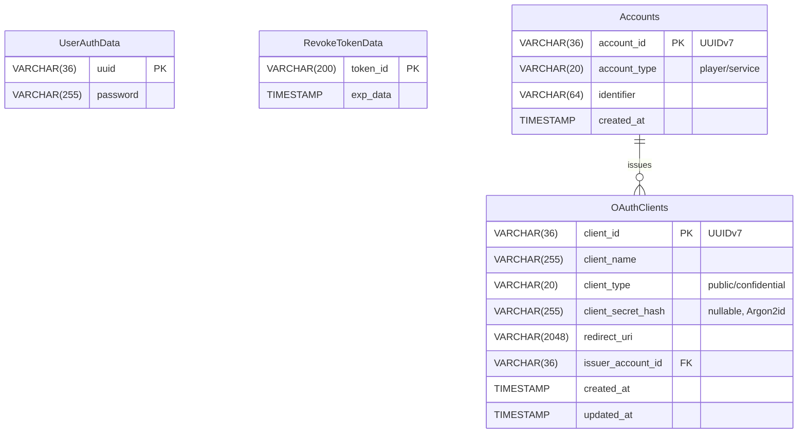

# 💾 Database Record Data Reference

## 👤 UserAuthData

| UUID        | Password      | Temporary |
|-------------|---------------|-----------|
| Player UUID | argon2 hashed | Boolean   |

## 🔑 RevokeTokenData

| TokenId        | Exp data |
|----------------|----------|
| Token Id (200) | Date     |

---

## 🆔 Accounts

| account_id | account_type | identifier | created_at |
|------------|--------------|------------|------------|
| VARCHAR(36) PK (UUIDv7) | "player" / "service" | VARCHAR(64) | TIMESTAMP |

### Notes
- `account_id`: UUIDv7（時間ソート可能）
- `account_type`: アカウントの種別
- `identifier`: プレイヤーの場合はUUID、サービスの場合はサービス名

---

## 🔐 OAuthClients

| client_id | client_name | client_type | client_secret_hash | redirect_uri | issuer_account_id | created_at | updated_at |
|-----------|-------------|-------------|-------------------|--------------|-------------------|------------|------------|
| VARCHAR(36) PK (UUIDv7) | VARCHAR(255) | "public" / "confidential" | Argon2id hash (nullable) | VARCHAR(2048) | FK → Accounts | TIMESTAMP | TIMESTAMP |

### Notes
- `client_id`: UUIDv7（時間ソート可能）
- `client_secret_hash`: Argon2idでハッシュ化。Publicクライアントの場合はNULL
- `redirect_uri`: 正規表現パターンをサポート（例: `https://example\.com/callback.*`）
- `issuer_account_id`: Accountsテーブルへの外部キー

---

## 📊 ER Diagram

